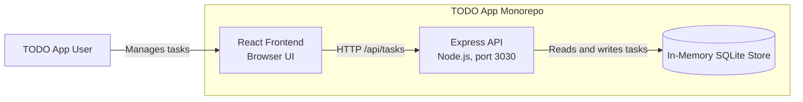
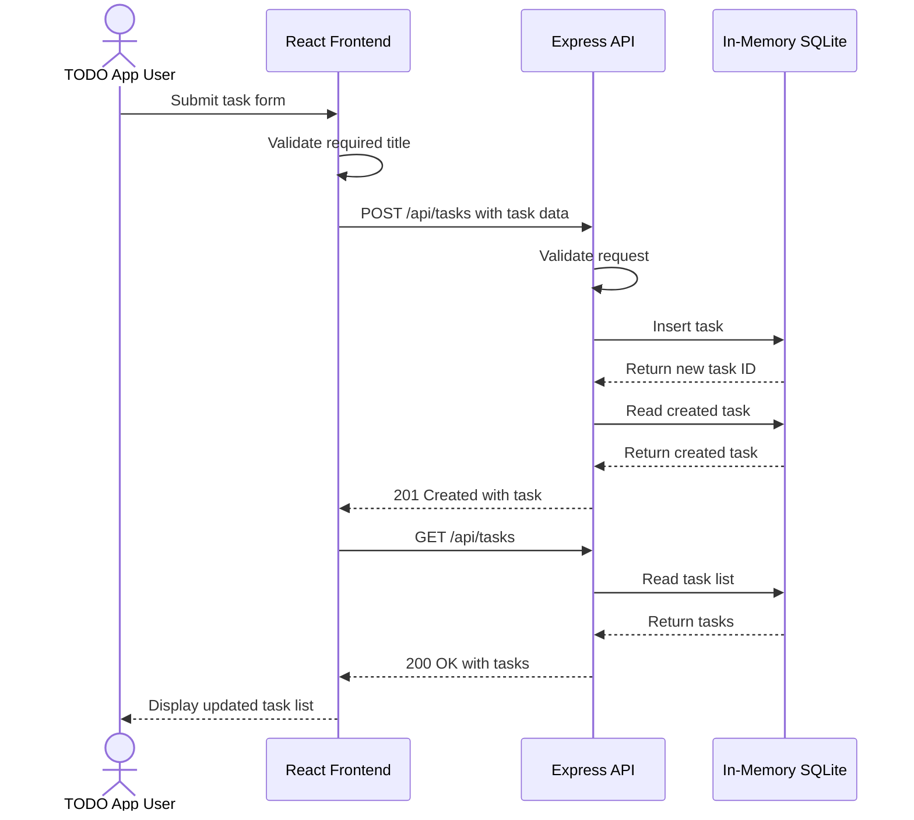

# Cloud Architecture Overview

## System Context

## Create a TODO Sequence

## Component Responsibilities

- **React frontend:** Presents the task interface and sends task operations to the API. During local development, the React development server proxies `/api` requests to `http://localhost:3030`.
- **Express API:** Provides task create, read, update, completion, and delete endpoints under `/api/tasks`.
- **In-memory store:** Uses an in-memory SQLite database owned by the Express process. Data is process-local and is lost when the API restarts.

The frontend and backend are separate npm workspaces under `packages/frontend` and `packages/backend`. The root workspace starts both applications together with `npm run start`.
